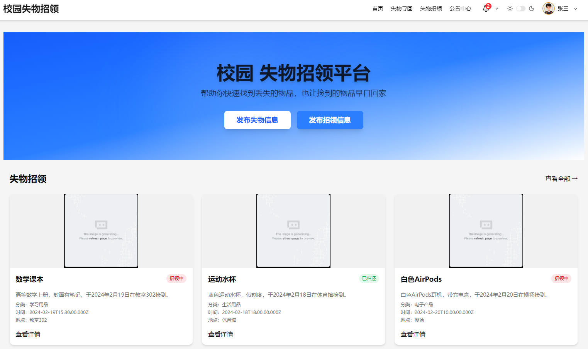
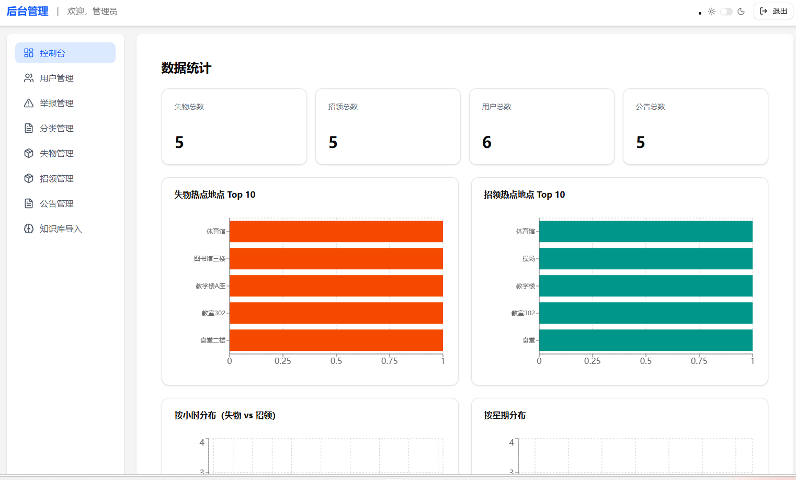

# 🧭 智能失物招领平台 · LostAndFound

[](https://github.com/hzj2293167543/lostandFound/actions/workflows/ci.yml)
[](LICENSE)
[](https://www.docker.com/)
[](https://sentry.io/)

&gt; **2026 届毕业设计** | 一个基于 **RAG 检索增强生成** 与 **Monorepo 架构**
的全栈智能失物招领平台。

---

## ✨ 核心亮点

- 🧠 **AI 智能助手**：基于本地向量数据库（pgvector）+
  Ollama 的 RAG 问答系统，支持流式输出与对话持久化。
- 📦 **Monorepo 工程化**：pnpm workspace 管理前后端，共享类型包确保 API 契约安全。
- 🐳 **容器化部署**：Docker Compose 一键编排前端（Nginx）、后端（Node）、数据库（PostgreSQL）。
- 🔄 **CI/CD 流水线**：GitHub Actions 自动化 Lint、构建与质量门禁。
- 🎯 **错误监控闭环**：Sentry 接入，支持 SourceMap 还原与 Session Replay。
- ⚡ **高性能渲染**：虚拟滚动 + 哨兵无限加载，支持万级数据流畅滚动。

---

## 🛠️ 技术栈

| 分类           | 技术选型                                                                                             |
| :------------- | :--------------------------------------------------------------------------------------------------- |
| **前端**       | React 19.2.4 + TypeScript 5.9.3 + Vite 7.3.1 + TailwindCSS 4.1.18 + Shadcn/ui                        |
| **状态与请求** | TanStack Query 5.91.0 + Zustand 5.0.11                                                               |
| **表单**       | react-hook-form 7.71.2 + zod 4.3.6                                                                   |
| **后端**       | NestJS 10.x + PostgreSQL 15.x + pgvector                                                             |
| **AI**         | Ollama (nomic-embed-text) + GLM-4-Flash API + LangChain.js 1.3.0                                     |
| **文档处理**   | pdf-parse 2.4.5 · mammoth 1.12.0 · officeparser 6.0.7 · pdfkit 0.18.0 · docx 9.6.1 · pptxgenjs 4.0.1 |
| **工程化**     | pnpm 10.19.0 Monorepo + Oxlint 1.41.0/ESLint 9.39.2 + Prettier 3.8.1 + Husky 9.1.7 + Volta           |
| **测试**       | Vitest 4.0.18 + Playwright 1.58.0                                                                    |
| **部署**       | Docker Compose + Nginx + GitHub Actions                                                              |
| **监控**       | Sentry 10.48.0                                                                                       |

---

## 🚀 快速启动

### 环境要求

- Node.js &gt;= 24（推荐使用 [Volta](https://volta.sh/) 自动切换）
- pnpm &gt;= 10.19.0
- Docker &amp; Docker Compose
- Ollama（本地部署 Embedding 模型）

### 1. 克隆仓库

```bash
git clone https://github.com/hzj2293167543/lostandFound.git
cd lostAndFound
```

### 2. 安装依赖

```bash
pnpm install
```

### 3. 环境变量配置

```bash
cp apps/frontend/.env.example apps/frontend/.env
cp apps/backend/.env.example apps/backend/.env
```

根据需要填写 Sentry DSN、数据库连接串、GLM-4 API Key 等。

### 4. 拉取 Ollama Embedding 模型

```bash
ollama pull nomic-embed-text
```

### 5. 启动开发环境

```bash
pnpm dev:frontend    # 前端 http://localhost:5173
pnpm dev:backend     # 后端 http://localhost:3000
pnpm run dev         # 前端 + ai + 数据库，后端不运行，idea中开启debug模式
pnpm run dev:all     # 前端 +后端 +数据库
```

### 6. Docker 一键部署

```bash
docker-compose up -d --build
```

访问 `http://localhost` 即可。

---

## 📂 项目结构（Monorepo）

```
.
├── .github/workflows        # GitHub Actions CI 配置
├── .trae/skills             # Trae AI Skill 沉淀库
├── apps
│   ├── frontend             # 前端 React 应用
│   ├── backend              # 后端 NestJS 应用
│   └── ollama               # Ollama 服务容器
├── packages
│   └── shared               # 共享类型定义、Zod Schema、工具函数
├── docker-deploy            # 生产部署配置
├── docker                   # Docker 构建文件
├── docker-compose.yml       # 开发环境服务编排
├── pnpm-workspace.yaml      # Monorepo 工作区定义
└── README.md
```

---

## 🤖 AI 功能详解（RAG 工作流）

1. **知识注入**：管理员在后台上传 PDF / Word 等公告文档。
2. **解析分割**：后端调用 `officeparser` / `pdf-parse` 提取文本，LangChain 进行语义切片。
3. **向量化存储**：调用本地 Ollama (`nomic-embed-text`) 生成 726 维向量，存入 PostgreSQL `pgvector`
   字段。
4. **语义检索**：用户提问时，问题向量化后通过余弦相似度检索最相关的文档片段。
5. **流式生成**：检索结果作为上下文，提交给 GLM-4-Flash，通过 SSE 流式返回前端。

---

## 🔍 性能与质量保障

| 模块           | 措施                                                                  |
| :------------- | :-------------------------------------------------------------------- |
| **渲染性能**   | `@tanstack/react-virtual` 3.13.23 + IntersectionObserver 哨兵无限滚动 |
| **代码规范**   | Oxlint + ESLint + Prettier + Husky + lint-staged                      |
| **自动化测试** | Vitest 单元测试 + Playwright E2E 关键路径测试                         |
| **错误监控**   | Sentry + SourceMap 自动上传 + Session Replay                          |
| **CI/CD**      | GitHub Actions 自动化 Lint / Build，Docker Compose 一键部署           |

---

## 🧪 自动化测试

本项目采用 **Vitest** 作为测试框架，实现了完整的测试体系，包括单元测试、组件测试和冒烟测试。

### 📋 测试覆盖范围

| 测试类型         | 说明                             | 位置                                  |
| :--------------- | :------------------------------- | :------------------------------------ |
| **前端冒烟测试** | 验证应用启动、关键业务流程初始化 | `apps/frontend/__tests__/smoke/`      |
| **前端组件测试** | 测试 UI 组件功能                 | `apps/frontend/__tests__/components/` |
| **前端页面测试** | 测试页面渲染和交互               | `apps/frontend/__tests__/pages/`      |
| **后端冒烟测试** | 验证后端核心业务逻辑             | `apps/backend/__tests__/smoke/`       |
| **工具库测试**   | 测试共享工具函数                 | `packages/utils/__test__/`            |

### 🚀 运行测试

```bash
# 运行所有测试（监视模式）
pnpm test

# 运行所有测试（单次运行）
pnpm test:run

# 仅运行前端测试
pnpm --filter @monorepo/frontend test

# 仅运行后端测试
pnpm --filter @monorepo/backend test
```

### ✅ 冒烟测试示例

#### 前端冒烟测试

- 应用启动验证
- React 渲染环境测试
- 关键路径流程初始化（登录、发布物品、搜索）

#### 后端冒烟测试

- 核心业务逻辑验证
- 数据验证测试
- API 流程初始化模拟

---

## 🧠 开发效率与 AI 协作（Trae Skill 沉淀）

本项目全程使用 **Trae (字节跳动 AI 原生 IDE)** 辅助开发，并将团队规范与常见解决方案固化为可复用的
**Trae Skill**。

| Skill 名称               | 触发场景                     | 核心约束                                                               |
| :----------------------- | :--------------------------- | :--------------------------------------------------------------------- |
| `backend`                | 编写后端业务逻辑             | 强制从 `shared` 引入 DTO、禁止 Controller 写业务逻辑、禁止滥用 `async` |
| `/review`                | 代码审查（本地/远程 PR）     | 自动化 `gh pr checkout` + `preflight`，输出结构化 Review               |
| `/fix`                   | 解决无法自动修复的 Lint 错误 | 分阶段分析 → 定向修复 → 二次验证，严禁 `eslint-disable`                |
| `front-design`           | 创建高设计质量的前端界面     | 强制脱离"AI 塑料感"，输出有明确美学方向的界面代码                      |
| `writing-frontend-logic` | 编写 React 逻辑/请求/表单    | 强制使用 TanStack Query、react-hook-form+zod、虚拟滚动、常量枚举化     |
| `writing-zod-schema`     | 定义前端表单 Zod Schema      | 强制 `z.coerce.number()` 处理表单数字输入                              |

**价值量化**：

- 新人上手成本降低，Trae 在对应场景自动加载 Skill，直接输出规范代码。
- 代码审查准备时间从 **5 分钟压缩到 30 秒**（`/review` Skill 自动化 `gh pr checkout` +
  `preflight`）。
- 所有 Skill 内置"熔断机制"，确保 AI 辅助不牺牲代码质量。

&gt; 📁 完整 Skill 定义文件见 `.trae/skills/` 目录。

---

## 📸 项目截图

|                首页浏览                |              AI 智能助手               |               后台管理               |
| :------------------------------------: | :------------------------------------: | :----------------------------------: |
|  |  |  |

---

## 🔄 GitHub Actions CI/CD 工作流

本项目配置了完整的 GitHub Actions 工作流，实现自动化构建、测试和部署。

### 📋 工作流列表

| 工作流名称         | 触发条件                          | 功能描述                          |
| :----------------- | :-------------------------------- | :-------------------------------- |
| **CI**             | `push`/`pull_request` 到 `master` | 自动化 Lint、测试、构建           |
| **Build and Push** | 推送 `v*` tag / 手动触发          | 构建并推送 Docker 镜像到仓库      |
| **Docker Deploy**  | `push` 到 `master` / 手动触发     | 完整 CI + 构建镜像 + 部署到服务器 |

### 🚀 使用方式

#### 1. 配置 GitHub Secrets

首先需要在仓库的 **Settings → Secrets and variables → Actions** 中配置必要的 Secrets。

详细配置说明请参考：[.github/workflows/SECRETS.md](.github/workflows/SECRETS.md)

#### 2. 自动部署（推荐）

推送代码到 `master` 分支会自动触发：

1. CI 检查（Lint + Test + Build）
2. 构建并推送 Docker 镜像
3. 部署到服务器

#### 3. 手动触发部署

进入 **Actions → Docker Deploy → Run workflow**，可以选择：

- 部署目标：`all` / `frontend` / `backend` / `postgres` / `ollama`
- 是否清除数据库卷：`true` / `false`

#### 4. 仅构建推送镜像

如果只需要构建和推送镜像而不部署，可以：

- 推送标签：`git tag v1.0.0 && git push origin v1.0.0`
- 或手动触发 **Build and Push** 工作流

---

## 📄 License

本项目采用 [MIT](LICENSE) 协议。

---

## 👤 关于作者

**zjHuang** - 2026 届应届毕业生，前端开发方向。

- **求职意向**：前端开发工程师 / AI全栈开发工程师
